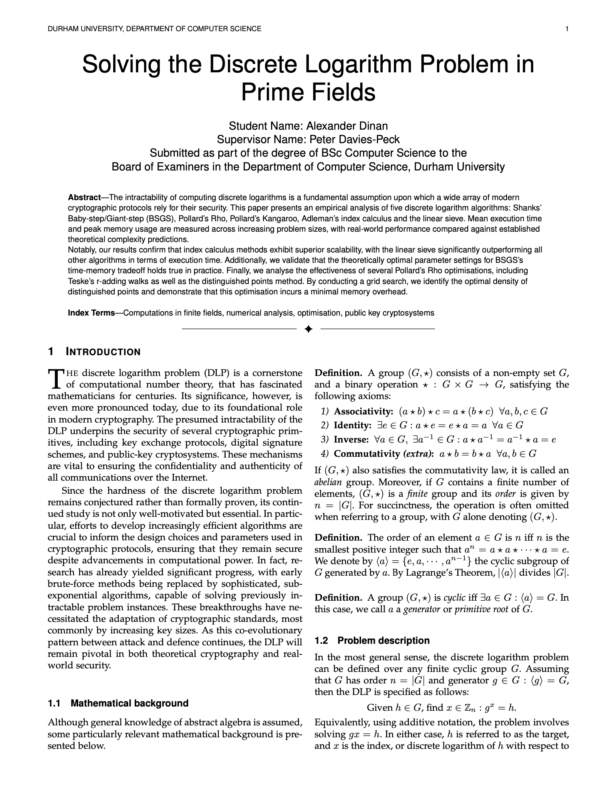

# 🔐 Discrete Logarithm Solver

Provides performant Python implementations of several **Discrete Logarithm Problem (DLP)** algorithms for prime-order multiplicative subgroups of prime fields ($F_p$).


Given the following parameters:
- $p$ - the prime modulus. Specifies the field $𝔽_p$ we are working in
- $g$ - the generator element of the multiplicative subgroup $\langle g \rangle$ of $𝔽_p$
- $h$ - the target element. We must have $h \in \langle g \rangle$
- $n$ - the subgroup order $|\langle g \rangle|$

Output: $\quad x \in [0,n-1]: \text{ such that } g^x \equiv h \bmod p$. We say that $x = \log_g{h}$

<br>

## Usage
First install the sympy module with `pip install sympy`. 
Then to find the discrete logarithm of `h=9292495388` modulo `p=554240741459` with base `g=4` and thus group order `n=277120370729`:

```bash
python main.py 554240741459 4 9292495388 277120370729
```


<br>

## Discrete log algorithms implemented
- Shanks' Baby-step/Giant-step - exponential - $O(\sqrt{n})$
- Pollard's Rho (6 variations) - exponential - $O(\sqrt{n})$
- Pollard's Kangaroo (2 variations) - exponential - $O(\sqrt{n})$
- Pohlig-Hellman - n/a - n/a
- Adleman's Index Calculus - subexponential - $L_p(0.5, \sqrt{2})$
- Linear Sieve - subexponential - $L_p(0.5, 1)$

<br>

## Research Paper
[](paper.pdf)

*Click the image above to view/download the full paper.*
